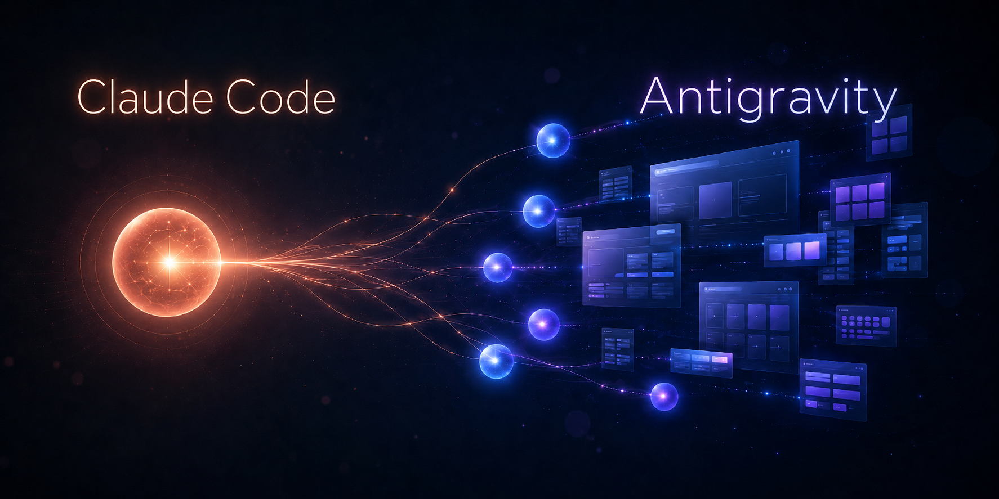

<p align="center">
  
</p>

# Gemini Subagents — a Claude × Antigravity skill

> **Manager + workers for building websites.** Your orchestrator agent (Claude) owns the *taste*; cheap, fast **Gemini** workers do the bulk generation. Includes the trick to use **Gemini 3.5 Flash** on a free/consumer account via **Antigravity**.


---

## Why

Most AI-built websites look templated because **one model does everything** — design, copy, layout, code — and fast models drift toward generic output ("AI slop").

This skill splits the roles:

```
brief ─▶ [ MANAGER · Claude ] ── design direction · split work · write specs · review + audit
              │   ▲
         spec │   │ code  (reads the files, audits, sends fixes)
              ▼   │
         [ WORKERS · Gemini ] ── bulk code generation (fast + cheap)
```

- **Manager (Claude):** holds the quality bar — locks the aesthetic, writes precise specs, reviews and audits every result.
- **Workers (Gemini):** generate the volume — fast and cheap.

Result: **non-generic UI, faster and cheaper**, without handing taste to a fast model.

---

## Two modes

| Mode | Worker | Driven by | Best for |
|---|---|---|---|
| **A — Headless CLI** | Gemini CLI (`gemini -p`) | The agent (automated, parallel) | Fully automated builds |
| **B — Antigravity handoff** | **Gemini 3.5 Flash** in Antigravity | A human runs Antigravity | Reaching 3.5 Flash on consumer accounts |

In **Mode B**, Claude and Antigravity share the workspace filesystem: Claude writes a spec file, you run Antigravity to implement it, Antigravity writes the code into the repo, and Claude reads + audits it — no copy-pasting code.

---

## Models

| Model ID | Where | Use for |
|---|---|---|
| `gemini-3-flash-preview` | Gemini CLI | Default headless worker (Gemini 3 Flash) |
| `gemini-2.5-flash` | Gemini CLI | Stable fallback worker |
| `gemini-2.5-pro` | Gemini CLI | Hard / visually-critical parts |
| "Gemini 3.5 Flash" | Antigravity | Best worker on consumer accounts (interactive) |

> ⚠️ In the Gemini CLI, `gemini-3.5-flash`, `gemini-3-flash`, and `gemini-flash-latest` all return `ModelNotFoundError`. The real Gemini 3 Flash ID is **`gemini-3-flash-preview`**. True **Gemini 3.5 Flash** is currently reachable only via **Antigravity**. Google is winding down Gemini CLI access for Google One / unpaid tiers (announced June 18, 2026) — so on consumer accounts, Antigravity (Mode B) is the durable path.

---

## Install

One line (scans the repo's `skills/` folder via [`npx skills`](https://github.com/vercel-labs/agent-skills)):

```bash
npx skills add https://github.com/taherfarg/claude-antigravity-subagents
```

Just this skill:

```bash
npx skills add https://github.com/taherfarg/claude-antigravity-subagents --skill "gemini-subagents"
```

**Manual (Claude Code):** copy `skills/gemini-subagents/` into `~/.claude/skills/`.
**Other agents:** copy it into your agent's skills directory (e.g. Codex `~/.agents/skills/`). You can also paste `SKILL.md` straight into a chat.

**Requires:** the [Gemini CLI](https://github.com/google-gemini/gemini-cli) for Mode A, and/or [Antigravity](https://antigravity.google) for Mode B.

---

## Use it

Paste this to your orchestrator agent:

```
Be the director. Use Gemini workers to build this site — you write the specs and review,
the workers generate. Lock ONE aesthetic + exact font/color/spacing tokens with me first,
then build section by section and audit each result.

Mode A (automated): dispatch headless `gemini -m gemini-3-flash-preview -p ...` workers.
Mode B (Gemini 3.5 Flash): write specs to specs/ and I'll run them in Antigravity.

Brief: [describe the site in 2–4 sentences]
```

See [`skills/gemini-subagents/SKILL.md`](skills/gemini-subagents/SKILL.md) for the full workflow and [`spec-template.md`](skills/gemini-subagents/spec-template.md) for the spec format.

---

## FAQ

**“`gemini-3.5-flash` gives ModelNotFoundError.”** Correct — that ID doesn’t resolve in the Gemini CLI. Use `gemini-3-flash-preview`, or use Antigravity for true 3.5 Flash.

**“Do I need Antigravity?”** No — only for Mode B / Gemini 3.5 Flash. Mode A works with the Gemini CLI alone.

**“Why is Mode B manual?”** Antigravity is an interactive agentic IDE, not a headless CLI, so it can’t be auto-dispatched. The spec-file handoff keeps a human in the loop for one step.

**“Does this work with agents other than Claude?”** The skill format targets Claude Code, but any agent that can shell out (Mode A) or read/write files (Mode B) can play the manager role.

---

## Contributing

Issues and PRs welcome. Verify model IDs with `gemini -m <id> -p "ok"` before changing the model table — preview IDs change.

## License

MIT © 2026 Taher Farg ([@taherfarg](https://github.com/taherfarg))
